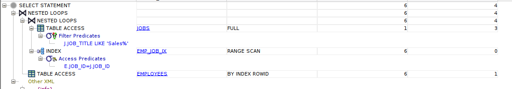
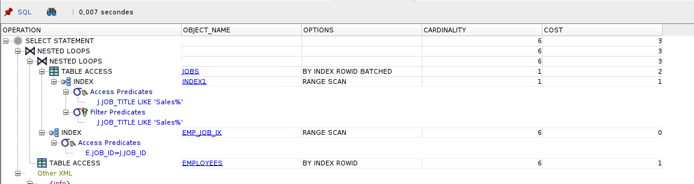
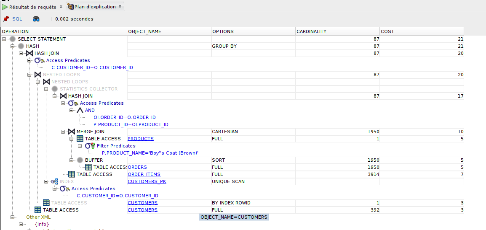

# TD 3

Questions du TD3 effectués sur la base de données mise en place pour le projet.

Pour chacune des requêtes expliquez :

- ce qu'elle fait
- son plan d'exécution
- si une optimisation vous semble possible

## B)

```sql
select e.first_name, e.last_name
from employees e, jobs j
where j.job_title like 'Sales%'
and e.job_id = j.job_id;
```

Retourne le nom et prénom des employés dont le poste commence par "Sales"

**plan d'exécution** :


**optimisation** : créer un index sur la colonne `job_title` comme on recherche par le début de la valeur, on n'aurait pas besoin de parcourir toute la table


## C)

```sql
select sum(oi.unit_price * oi.quantity), c.full_name from order_items oi, orders o, customers c, products p
where c.customer_id = o.customer_id
and oi.order_id = o.order_id
and p.product_id = oi.product_id
and p.product_name like 'Boy''s Coat (Brown)'
group by c.full_name;
```

Donne la recette faite sur les ventes du produit "Boy's Coat(brown)"



## D)

```sql

```
